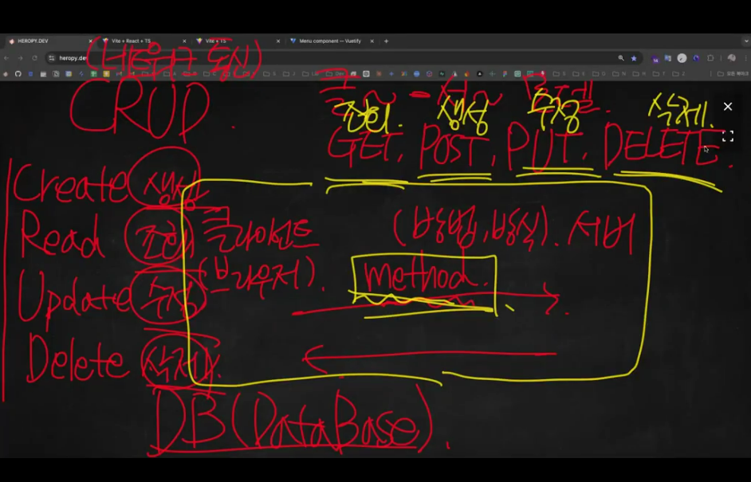

## CRUD
- 서버와 네트워크 통신을 통해 DB의 데이터를 생성, 조회, 수정, 삭제하는 작업을 의미한다.
  - `Create`: 서버에 새로운 데이터를 **생성**하는 작업 (HTTP **POST** 메서드를 사용)
  - `Read`: 서버에서 데이터를 **조회**하는 작업 (HTTP **GET** 메서드를 사용, GET: 기본값)
  - `Update`: 서버에 있는 기존 데이터를 **수정**하는 작업 (HTTP **PUT** 메서드를 사용)
  - `Delete`: 서버에 있는 데이터를 **삭제**하는 작업 (HTTP **DELETE** 메서드를 사용)

    
    -> 클라이언트-서버 모델